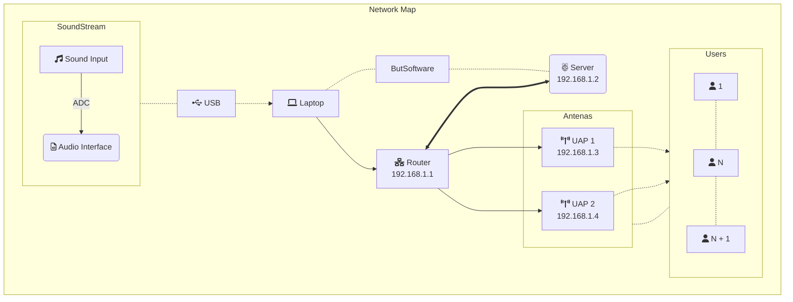

# SilentDisco
Discoteca del Silenci

Objects Diagram

```mermaid
flowchart TB
    SoundInput[fas:fa-music Sound Input ]
    AudioInterface(far:fa-file-audio Audio Interface)
    Laptop[fas:fa-laptop Laptop]
    Server("fab:fa-raspberry-pi Server"
    192.168.1.2)
    Router["fas:fa-network-wired Router
    192.168.1.1"]
    UAP1["fas:fa-tower-broadcast UAP 1
    192.168.1.3"]
    UAP2["fas:fa-tower-broadcast UAP 2
    192.168.1.4"]
    U1[fas:fa-user 1]
    U2[fas:fa-user N]
    U3[fas:fa-user N + 1]
    USB[fab:fa-usb USB]


    subgraph Users
    direction TB
    U1-.-U2
    U2-.-U3
    end

    subgraph Network Map
    Laptop-.-ButSoftware-..-Server
    SoundStream-.- USB -.-> Laptop
    Router<==>Server
    Laptop-->Router
    Router--->UAP1-.->Users
    Router--->UAP2-.->Users

Antenas-.-Users

    subgraph SoundStream
    direction TB
    SoundInput -- "ADC" --> AudioInterface
    end

    subgraph Antenas
    UAP1
    UAP2 
    end
    end

    
```
